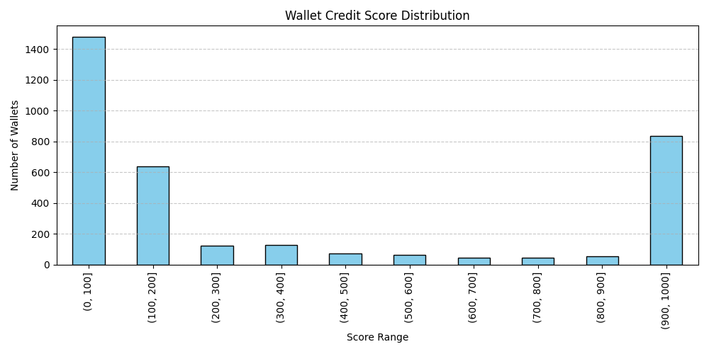

## Score Distribution

### Observations:

- **Majority of wallets (over 1400)** have scores in the **0–100** range, indicating poor or risky DeFi behavior (likely high borrow, low repay, or liquidations).
- A **secondary cluster (~650 wallets)** exists in the **100–200** range — still relatively low.
- Very few wallets fall in the **200–800** range, indicating only a small group shows average behavior.
- A **notable spike** in the **900–1000** range (800+ wallets) represents high-trust wallets that repay loans, avoid liquidations, and actively deposit.

### Conclusion:

The distribution is **bimodal** — either users behave poorly (score < 200) or exceptionally (score > 900), with few in between. This suggests that wallet behavior is **polarized** in DeFi lending platforms like Aave.
